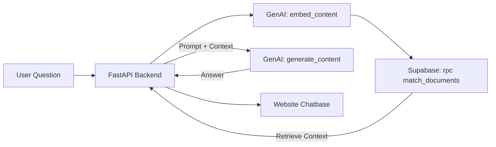

# Building a RAG Agent with Google GenAI SDK & Supabase

This guide details how to build a lightweight, high-performance RAG (Retrieval-Augmented Generation) agent using the **Google GenAI SDK** directly. This approach removes the complexity of LangChain, giving you full control over your prompts and logic.

> [!TIP]
> **New to RAG?** RAG combines document search with AI generation. Your AI retrieves relevant context from your documents, then uses that context to generate accurate, grounded answers.

## 1. Architecture Overview (Simplified)



## 2. Technology Stack
*   **AI SDK:** `google-generativeai` (Official Google SDK)
*   **Vector Database:** `Supabase` (PostgreSQL + `pgvector` extension)
*   **Backend Framework:** `FastAPI` (Python)
*   **Embedding Model:** `text-embedding-004` (768 dimensions)
*   **LLM:** `gemini-1.5-flash` (fast and cost-effective)
*   **Dependencies:** `fastapi`, `uvicorn`, `supabase`, `python-dotenv`, `google-generativeai`

> [!WARNING]
> **Cost Considerations:** While Gemini has a generous free tier, be aware of rate limits:
> - Embedding API: 1,500 requests/day (free tier)
> - Generation API: 15 requests/minute (free tier)
> - Monitor usage in [Google AI Studio](https://aistudio.google.com/)

---

## 3. Environment Variables

Create a `.env` file in your `backend/` folder with the following variables:

```env
GOOGLE_API_KEY=your_google_api_key_here
SUPABASE_URL=https://your-project-id.supabase.co
SUPABASE_SERVICE_KEY=your_supabase_service_role_key_here
```

> [!CAUTION]
> Never commit `.env` to version control. Add it to your `.gitignore`.

---

## 4. Step-by-Step Implementation

### Step 1: Supabase Setup (SQL)
Run this in your Supabase SQL Editor to enable vector search for Gemini embeddings.

> [!IMPORTANT]
> **Vector Dimensions:** The `vector(768)` must match your embedding model. Gemini's `text-embedding-004` produces 768-dimensional vectors. Using a different dimension will cause errors.

```sql
-- 1. Enable pgvector extension
create extension if not exists vector;

-- 2. Create documents table
create table documents (
  id bigserial primary key,
  content text,
  metadata jsonb,
  embedding vector(768) -- Matches Gemini text-embedding-004
);

-- 3. Create vector similarity search function
-- The match_threshold is a similarity score (0-1): higher = more strict
-- Start with 0.5 for testing, increase to 0.7+ for production
create function match_documents (
  query_embedding vector(768),
  match_threshold float,
  match_count int
)
returns table (
  id bigint,
  content text,
  metadata jsonb,
  similarity float
)
language plpgsql
as $$
begin
  return query
  select
    documents.id,
    documents.content,
    documents.metadata,
    1 - (documents.embedding <=> query_embedding) as similarity
  from documents
  where 1 - (documents.embedding <=> query_embedding) > match_threshold
  order by similarity desc
  limit match_count;
end;
$$;

-- 4. Create vector index for fast similarity search
-- Without this, every query does a full table scan
-- Note: Only create AFTER inserting data (IVFFlat needs existing rows to build lists)
create index on documents
  using ivfflat (embedding vector_cosine_ops)
  with (lists = 100);
```

### Step 2: Build the Backend (`server.py`)

**Installation:**
```bash
# Create backend folder
mkdir backend
cd backend

# Install dependencies
pip install fastapi uvicorn google-generativeai supabase python-dotenv
```

**`server.py`:**
```python
import os
import logging
import google.generativeai as genai
from fastapi import FastAPI, HTTPException
from fastapi.middleware.cors import CORSMiddleware
from pydantic import BaseModel, field_validator
from supabase import create_client, Client
from dotenv import load_dotenv

load_dotenv()

# Setup logging
logging.basicConfig(level=logging.INFO)
logger = logging.getLogger(__name__)

app = FastAPI()

# --- CORS Middleware ---
# For development: allow all origins
# For production: replace with your actual domain
ALLOWED_ORIGINS = os.getenv("ALLOWED_ORIGINS", "*").split(",")

app.add_middleware(
    CORSMiddleware,
    allow_origins=ALLOWED_ORIGINS,
    allow_credentials=True,
    allow_methods=["*"],
    allow_headers=["*"],
)

# 1. Configuration
genai.configure(api_key=os.getenv("GOOGLE_API_KEY"))

# Use system_instruction for a cleaner separation of system vs. user prompts
model = genai.GenerativeModel(
    'gemini-1.5-flash',
    system_instruction=(
        "You are Mithil Ravulapalli's portfolio AI assistant. "
        "Answer questions about Mithil's skills, projects, and Agentic AI work "
        "based ONLY on the context provided in each message. "
        "If the answer isn't in the context, say \"I don't have that info, but you can email Mithil!\" "
        "Be professional, concise, and friendly."
    )
)

url: str = os.getenv("SUPABASE_URL")
key: str = os.getenv("SUPABASE_SERVICE_KEY")
supabase: Client = create_client(url, key)

class ChatRequest(BaseModel):
    message: str
    
    @field_validator('message')
    @classmethod
    def validate_message(cls, v):
        if not v or not v.strip():
            raise ValueError('Message cannot be empty')
        if len(v) > 1000:
            raise ValueError('Message too long (max 1000 characters)')
        return v.strip()

@app.get("/health")
async def health_check():
    """Health check endpoint for monitoring"""
    return {"status": "healthy", "service": "RAG Agent"}

@app.post("/chat")
async def chat_endpoint(request: ChatRequest):
    try:
        logger.info(f"Received query: {request.message[:100]}...")
        
        # A. Embed the User's Query
        result = genai.embed_content(
            model="models/text-embedding-004",
            content=request.message,
            task_type="retrieval_query"
        )
        query_vector = result['embedding']

        # B. Search Supabase (Vector Search)
        # Start with lower threshold (0.5) for better recall
        # Increase to 0.7+ if getting irrelevant results
        response = supabase.rpc("match_documents", {
            "query_embedding": query_vector,
            "match_threshold": 0.5,
            "match_count": 3
        }).execute()
        
        logger.info(f"Retrieved {len(response.data) if response.data else 0} documents")

        # C. Handle empty results
        if not response.data:
            logger.warning("No matching documents found")
            return {"reply": "I don't have enough info to answer that. Try emailing Mithil!"}

        # D. Construct Context
        context_text = "\n\n".join([doc['content'] for doc in response.data])

        # E. Generate Answer with Gemini
        prompt = f"CONTEXT:\n{context_text}\n\nQUESTION: {request.message}"
        generation = model.generate_content(prompt)
        
        logger.info("Generated response successfully")
        return {"reply": generation.text}

    except ValueError as e:
        logger.error(f"Validation error: {e}")
        raise HTTPException(status_code=400, detail=str(e))
    except Exception as e:
        logger.error(f"Error in /chat endpoint: {e}")
        return {"reply": "Sorry, something went wrong. Please try again later."}
```

**Run the server:**
```bash
uvicorn server:app --reload
```

You should see output like:
```
INFO:     Uvicorn running on http://127.0.0.1:8000 (Press CTRL+C to quit)
```

Test the health endpoint: `curl http://localhost:8000/health`

---

### Step 3: Ingest Data (`ingest.py`)
Run this script ONCE to upload your [About_me.md](file:///c:/Users/mithi/OneDrive/Documents/Personal%20Website/Web_v2/About_me.md) content to Supabase.

> [!NOTE]
> This script splits your document into chunks and generates embeddings for each. With a large document, this may take a few minutes and consume API quota.

```python
import os
import time
import logging
import google.generativeai as genai
from supabase import create_client, Client
from dotenv import load_dotenv

load_dotenv()

logging.basicConfig(level=logging.INFO)
logger = logging.getLogger(__name__)

# Config
genai.configure(api_key=os.getenv("GOOGLE_API_KEY"))
url: str = os.getenv("SUPABASE_URL")
key: str = os.getenv("SUPABASE_SERVICE_KEY")
supabase: Client = create_client(url, key)

def split_text(text, max_chars=1000, overlap=200):
    """
    Splits text into chunks by paragraphs with smart overlap.
    Overlap preserves sentence boundaries to avoid cutting mid-sentence.
    """
    paragraphs = text.split('\n\n')
    chunks = []
    current_chunk = ""

    for para in paragraphs:
        if len(current_chunk) + len(para) < max_chars:
            current_chunk += para + "\n\n"
        else:
            if current_chunk:
                chunks.append(current_chunk.strip())
            
            # Find a good overlap point (last sentence boundary)
            if len(current_chunk) > overlap:
                # Look for last period within overlap region
                overlap_start = len(current_chunk) - overlap
                last_period = current_chunk.rfind('.', overlap_start)
                if last_period != -1:
                    overlap_text = current_chunk[last_period + 1:].strip()
                else:
                    overlap_text = current_chunk[-overlap:].strip()
            else:
                overlap_text = current_chunk.strip()
            
            current_chunk = overlap_text + "\n\n" + para + "\n\n"
    
    if current_chunk.strip():
        chunks.append(current_chunk.strip())
    
    return chunks

def main():
    # 1. Load File
    file_path = "../About_me.md"
    try:
        with open(file_path, "r", encoding="utf-8") as f:
            text = f.read()
        logger.info(f"Loaded {len(text)} characters from {file_path}")
    except FileNotFoundError:
        logger.error(f"File not found: {file_path}")
        logger.info("Make sure About_me.md exists in the parent directory")
        return

    # 2. Clear old data to prevent duplicates on re-runs
    logger.info("Clearing existing documents from About_me.md...")
    supabase.table("documents").delete().eq(
        "metadata->>source", "About_me.md"
    ).execute()

    # 3. Split into Chunks
    chunks = split_text(text)
    logger.info(f"Split into {len(chunks)} chunks")

    # 4. Embed & Upload with rate limiting
    successful = 0
    failed = 0
    
    for i, chunk in enumerate(chunks):
        try:
            logger.info(f"Processing chunk {i+1}/{len(chunks)}...")

            # Generate Embedding
            result = genai.embed_content(
                model="models/text-embedding-004",
                content=chunk,
                task_type="retrieval_document"
            )
            embedding = result['embedding']

            # Insert into Supabase
            data = {
                "content": chunk,
                "metadata": {"source": "About_me.md", "chunk_index": i},
                "embedding": embedding
            }
            supabase.table("documents").insert(data).execute()
            successful += 1
            
            # Rate limiting: small delay between requests
            if i < len(chunks) - 1:  # Don't wait after last chunk
                time.sleep(0.5)
                
        except Exception as e:
            logger.error(f"Failed to process chunk {i+1}: {e}")
            failed += 1
            continue

    logger.info(f"Ingestion complete! {successful} successful, {failed} failed")

if __name__ == "__main__":
    main()
```

**Run the ingestion:**
```bash
cd backend
python ingest.py
```

**To update your data later**, simply re-run `ingest.py`. The script automatically clears old data before inserting, so you won't get duplicates.

> [!IMPORTANT]
> After re-ingesting data, you should **rebuild the vector index** for optimal search performance:
> ```sql
> -- Run in Supabase SQL Editor
> REINDEX INDEX documents_embedding_idx;
> ```

---

### Step 4: Frontend Integration
Your [script.js](file:///c:/Users/mithi/OneDrive/Documents/Personal%20Website/Web_v2/assets/js/script.js) should call the backend `/chat` endpoint.

For complete frontend helper functions, see the separate [`frontend-helpers.js`](file:///c:/Users/mithi/OneDrive/Documents/Personal%20Website/Web_v2/frontend-helpers.js) file.

Here's the core chat integration:

```javascript
// Inside script.js — full handleUserMessage example

async function handleUserMessage(userMessage) {
  // Show a loading indicator in the chat UI
  appendMessage('assistant', 'Thinking...');

  try {
    const response = await fetch('http://localhost:8000/chat', {
      method: 'POST',
      headers: { 'Content-Type': 'application/json' },
      body: JSON.stringify({ message: userMessage })
    });

    if (!response.ok) {
      throw new Error(`Server error: ${response.status}`);
    }

    const data = await response.json();
    // Replace loading message with actual reply
    replaceLastMessage('assistant', data.reply);

  } catch (error) {
    console.error('Chat error:', error);
    replaceLastMessage('assistant', 'Sorry, I couldn\'t connect to the server. Please try again.');
  }
}

// Helper function to append messages to chat UI
function appendMessage(role, text) {
  const chatContainer = document.getElementById('chat-messages');
  const messageDiv = document.createElement('div');
  messageDiv.className = `message ${role}`;
  messageDiv.textContent = text;
  chatContainer.appendChild(messageDiv);
  chatContainer.scrollTop = chatContainer.scrollHeight;
}

// Helper function to replace the last message (for loading states)
function replaceLastMessage(role, text) {
  const chatContainer = document.getElementById('chat-messages');
  const lastMessage = chatContainer.lastElementChild;
  if (lastMessage) {
    lastMessage.textContent = text;
    lastMessage.className = `message ${role}`;
  }
}
```

> [!NOTE]
> In production, replace `http://localhost:8000` with your deployed backend URL.

---

## 5. Testing Your RAG Agent

### Local Testing

1. **Start the backend:**
   ```bash
   cd backend
   uvicorn server:app --reload
   ```

2. **Test with curl:**
   ```bash
   curl -X POST http://localhost:8000/chat \
     -H "Content-Type: application/json" \
     -d '{"message": "What projects has Mithil worked on?"}'
   ```

3. **Open your frontend** and try these test queries:

#### ✅ Good Test Questions (Should Work Well)
- "What projects has Mithil worked on?"
- "What are Mithil's technical skills?"
- "Tell me about Mithil's experience with AI"
- "What technologies does Mithil use?"

#### ❌ Questions That Should Fail Gracefully
- "What's the weather today?" → Should say info not available
- "What's 2+2?" → Should redirect to email or say not in context

### Expected Behavior

**Good response example:**
```json
{
  "reply": "Mithil has worked on several projects including [specific details from About_me.md]..."
}
```

**Fallback response example:**
```json
{
  "reply": "I don't have enough info to answer that. Try emailing Mithil!"
}
```

---

## 6. Troubleshooting

### Common Issues

#### ❌ "Model not found" or embedding errors
**Cause:** Invalid API key or model name

**Solution:**
1. Verify your `GOOGLE_API_KEY` is correct
2. Check you're using `models/text-embedding-004` (with the `models/` prefix)
3. Ensure your API key has Generative AI API enabled

#### ❌ "No matching documents found" for every query
**Cause:** Either no data in Supabase OR threshold too high

**Solution:**
1. Check if documents exist:
   ```sql
   SELECT COUNT(*) FROM documents;
   ```
2. Lower `match_threshold` to 0.3 temporarily
3. Verify embeddings were generated correctly:
   ```sql
   SELECT content, metadata FROM documents LIMIT 1;
   ```

#### ❌ "cannot adapt type 'list' using placeholder '%s'"
**Cause:** pgvector extension not properly enabled

**Solution:**
```sql
-- Re-run in Supabase SQL Editor
CREATE EXTENSION IF NOT EXISTS vector;
```

#### ❌ Frontend CORS errors
**Cause:** Backend not allowing your frontend domain

**Solution:**
- Development: Ensure `allow_origins=["*"]` in server.py
- Production: Set `ALLOWED_ORIGINS` env var to your domain:
  ```env
  ALLOWED_ORIGINS=https://mithilravulapalli.com
  ```

#### ❌ "Rate limit exceeded"
**Cause:** Too many API requests (free tier limits)

**Solution:**
1. Add delays in `ingest.py` (already included in improved version)
2. Monitor usage at [Google AI Studio](https://aistudio.google.com/)
3. Consider upgrading to paid tier for production

#### ❌ Slow response times
**Possible causes:**
- Large context being passed to LLM
- Supabase on free tier (slower)
- Too many chunks retrieved

**Solution:**
1. Reduce `match_count` from 3 to 2
2. Use smaller chunk sizes in `split_text()`
3. Consider upgrading Supabase tier for production

### Debug Mode

Enable detailed logging in `server.py`:
```python
# Change from INFO to DEBUG
logging.basicConfig(level=logging.DEBUG)

# Add this in chat_endpoint to see retrieved context
logger.debug(f"Context: {context_text[:200]}...")
```

### Verify Vector Search

Test your vector search directly in Supabase:
```sql
-- Get a sample embedding
SELECT embedding FROM documents LIMIT 1;

-- Test the match function (replace [...] with actual embedding)
SELECT * FROM match_documents(
  '[0.1, 0.2, ...]'::vector(768),
  0.5,
  3
);
```

---

## 7. Deployment

### Backend (FastAPI)
Deploy the `backend/` folder to a cloud platform. Here are recommended options:

| Platform | Free Tier | How to Deploy |
|---|---|---|
| **Render** | ✅ Yes | Connect your GitHub repo, set build command to `pip install -r requirements.txt` and start command to `uvicorn server:app --host 0.0.0.0 --port $PORT` |
| **Railway** | ✅ Yes | `railway init` → `railway up`, set env vars in dashboard |
| **Google Cloud Run** | ✅ Yes | Containerize with Docker, deploy via `gcloud run deploy` |

**Key steps for any platform:**
1. Create a `requirements.txt`:
   ```
   fastapi
   uvicorn
   google-generativeai
   supabase
   python-dotenv
   ```
2. Set your environment variables (`GOOGLE_API_KEY`, `SUPABASE_URL`, `SUPABASE_SERVICE_KEY`) in the platform's dashboard.
3. Update `allow_origins` in the CORS middleware to your actual frontend domain.
4. Update the `fetch` URL in `script.js` to point at your deployed backend URL.

### Frontend
Update your frontend code to use the production backend URL:
```javascript
const BACKEND_URL = 'https://your-backend.onrender.com'; // or your deployed URL

async function handleUserMessage(userMessage) {
  const response = await fetch(`${BACKEND_URL}/chat`, {
    method: 'POST',
    headers: { 'Content-Type': 'application/json' },
    body: JSON.stringify({ message: userMessage })
  });
  // ... rest of code
}
```

---

## 8. Why Google GenAI SDK Over LangChain?
*   **Cleaner:** No "Chain" abstractions. You can see exactly how the prompt is constructed.
*   **Faster:** Fewer layers of code between your app and the model.
*   **Lighter:** Smaller dependency footprint (no heavy LangChain packages).
*   **Native:** Uses the latest Gemini features (like `retrieval_query` task type) directly.
*   **Debuggable:** Easier to trace issues without framework magic.

---

## 9. Next Steps

- **Add authentication:** Protect your API with API keys or OAuth
- **Implement caching:** Cache embeddings and responses to save API costs
- **Add conversation history:** Store chat context for multi-turn conversations
- **Monitor usage:** Set up logging and analytics
- **Optimize chunks:** Experiment with different chunk sizes and overlap
- **Add sources:** Return which documents were used in the response

---

## Additional Resources

- [Google GenAI SDK Docs](https://ai.google.dev/)
- [Supabase Vector Documentation](https://supabase.com/docs/guides/ai)
- [FastAPI Documentation](https://fastapi.tiangolo.com/)
- [Gemini API Pricing](https://ai.google.dev/pricing)
